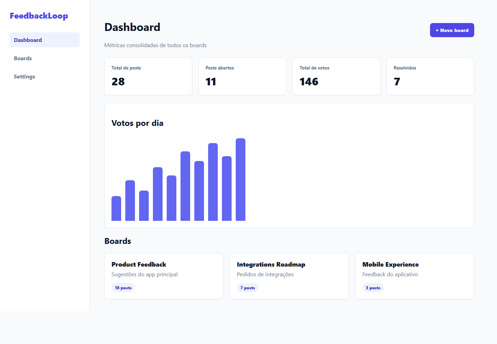
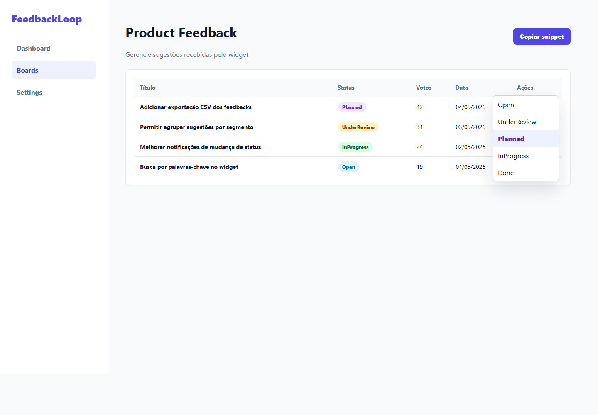
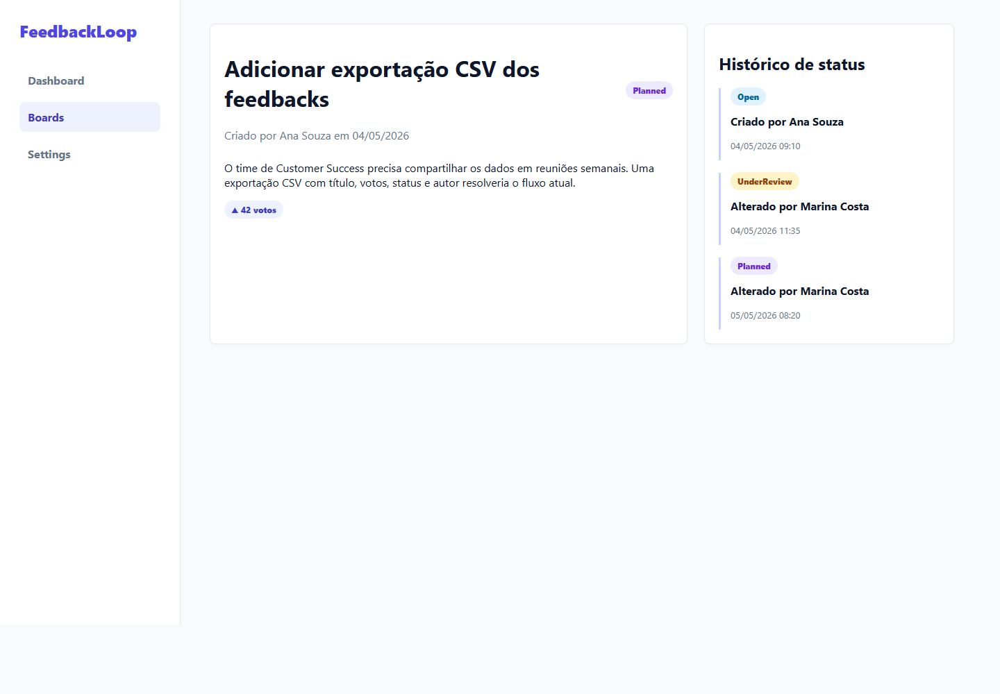
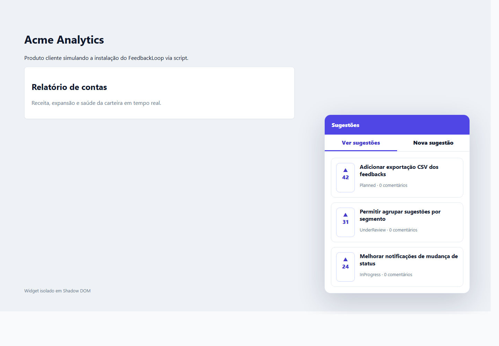
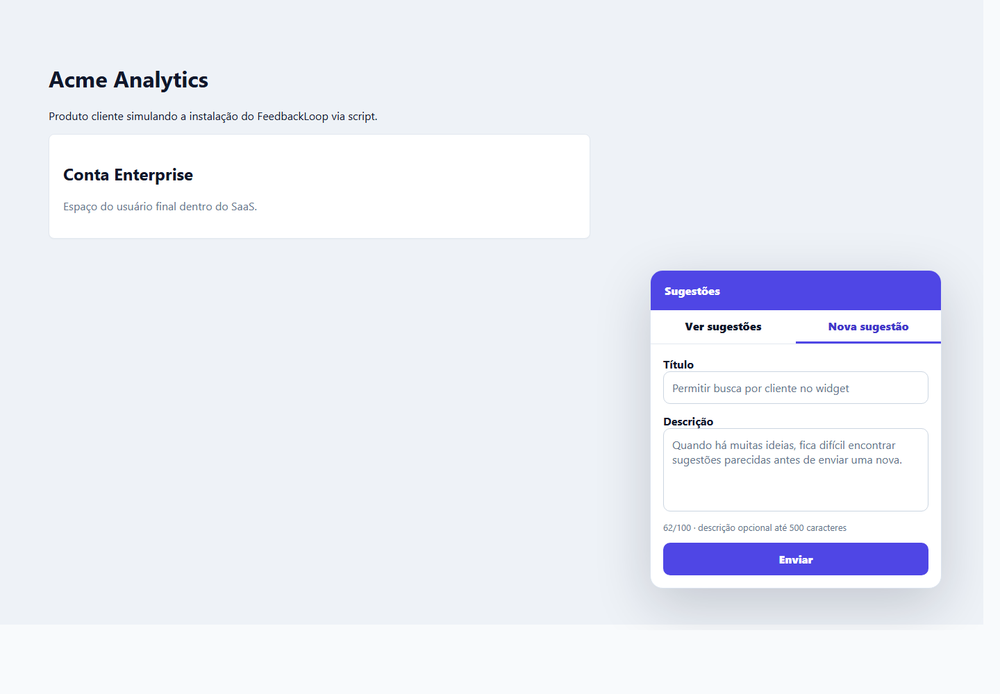

# FeedbackLoop

[](https://github.com/VictorSantos674/FeedbackLoop/actions/workflows/ci.yml)


Ferramenta B2B para coletar feedback de usuarios e gerenciar o roadmap de produto, uma alternativa simples e acessivel ao Canny.

O projeto cobre o fluxo completo de um produto de feedback: cadastro de workspace, painel administrativo autenticado, boards publicos, widget embarcavel para clientes finais, votos, mudancas de status e historico do roadmap.

## Por Que Este Projeto Existe

FeedbackLoop simula um SaaS real para times de produto: empresas criam boards publicos, instalam um widget no proprio app e acompanham sugestoes, votos e mudancas de status em um painel administrativo. O foco tecnico esta em isolamento multi-tenant, autenticacao segura, widget embarcavel e pipeline de qualidade automatizado.

## Comparativo Com Canny

| Recurso | FeedbackLoop | Canny |
| --- | --- | --- |
| Boards publicos de feedback | Sim | Sim |
| Widget embarcavel via script | Sim | Sim |
| Votos de usuarios finais | Sim | Sim |
| Painel administrativo | Sim | Sim |
| Multi-tenancy com isolamento por workspace | Sim | Sim |
| Historico de status do roadmap | Sim | Sim |
| Codigo aberto para avaliacao tecnica | Sim | Nao |
| Foco do projeto | Portfolio full-stack e arquitetura SaaS | Produto comercial completo |

## Screenshots

### Painel administrativo


*Dashboard com metricas consolidadas de todos os boards*


*Gestao de posts com mudanca de status inline*


*Historico de mudancas de status com linha do tempo*

### Widget embarcavel


*Widget instalado via `<script>` tag - lista de sugestoes com votacao*


*Formulario de nova sugestao com validacao inline*

## Como Funciona

Empresas instalam um widget JavaScript no proprio produto:

```html
<script src="https://cdn.feedbackloop.app/widget.umd.js"></script>
<script>
  FeedbackLoop.init({
    boardSlug: "meu-produto",
    endUserToken: "uuid-do-usuario",
    endUserName: "Joao Silva",
    apiBaseUrl: "https://api.feedbackloop.app"
  });
</script>
```

Os usuarios finais sugerem features e votam. A equipe gerencia tudo pelo painel administrativo.

## Stack

| Camada | Tecnologia |
| --- | --- |
| Backend | .NET 8, ASP.NET Core, EF Core, PostgreSQL |
| Painel | React 18, TypeScript, TanStack Query, Zustand |
| Widget | React 18, Vite, bundle UMD self-contained |
| Auth | JWT + Refresh Token com rotacao e deteccao de reutilizacao |
| Testes | xUnit, WebApplicationFactory, Moq, Vitest + Testing Library |
| CI/CD | GitHub Actions com build, testes, cobertura minima e smoke test Docker |

## Qualidade

| Area | Status |
| --- | --- |
| API | 22 testes passando |
| Cobertura da API | 82.23% line coverage |
| Coverage gate | Minimo de 60% no CI |
| Frontend app | Vitest + Testing Library |
| Widget | Vitest + Testing Library |
| Smoke test | Docker Compose sobe Postgres, API e app; valida `/health` e container web |

## Rodar Localmente Com Docker

```bash
cp .env.example .env
docker compose up --build
```

Acesse:

- Painel: http://localhost:3000
- API + Swagger: http://localhost:5000/swagger
- Health check: http://localhost:5000/health

## Rodar Sem Docker

### API

```bash
export ConnectionStrings__FeedbackLoopDb="Host=localhost;Database=feedbackloop;Username=postgres;Password=postgres"
export Jwt__Secret="segredo-forte-aqui-com-32-caracteres"

cd FeedbackLoop.Api
dotnet run
```

### Painel

```bash
cd feedbackloop-app
npm install
npm run dev
```

### Widget

```bash
cd feedbackloop-widget
npm install
npm run build
```

Depois abra `feedbackloop-widget/test.html` no navegador.

## Testes

```bash
# API
dotnet test FeedbackLoop.sln

# API com cobertura minima local
dotnet test FeedbackLoop.sln /p:CollectCoverage=true /p:Threshold=60 /p:ThresholdType=line

# Painel
cd feedbackloop-app && npm run test

# Widget
cd feedbackloop-widget && npm run test
```

O CI executa os tres suites e depois sobe `postgres`, `api` e `app` com Docker Compose para validar o endpoint `/health` da API e o container web.

## Arquitetura

### Multi-Tenancy

Cada empresa cliente e um `Workspace`. O `WorkspaceId` e extraido do JWT e aplicado como filtro global no EF Core. Dados de workspaces diferentes nao se cruzam nas queries autenticadas.

Os testes de integracao exercitam esse isolamento via HTTP real com `WebApplicationFactory`, banco EF InMemory por teste e pipeline ASP.NET Core completo.

### Widget Embarcavel

Bundle UMD self-contained com React embarcado, Shadow DOM para isolamento total de CSS e API publica `FeedbackLoop.init`. O produto cliente nao precisa instalar dependencias.

### Seguranca de Autenticacao

- Refresh tokens salvos como SHA-256 hash no banco
- Rotacao obrigatoria a cada uso
- Deteccao de reutilizacao: token revogado usado revoga a familia inteira
- Access token do painel fica apenas em memoria no Zustand, nunca no `localStorage`
- Refresh token persiste no `localStorage` para sobreviver ao reload

### Painel Administrativo

O painel usa filtros refletidos na URL via `useSearchParams`, cache com TanStack Query, mutations para alteracao de status e interceptor Axios com fila de requests enquanto o refresh token e renovado.

## Endpoints Principais

- `POST /api/auth/register`
- `POST /api/auth/login`
- `POST /api/auth/refresh`
- `GET /api/boards`
- `POST /api/boards`
- `GET /api/boards/{boardId}/posts`
- `PATCH /api/boards/{boardId}/posts/{postId}/status`
- `GET /api/widget/{boardSlug}/posts`
- `POST /api/widget/{boardSlug}/posts`
- `POST /api/widget/{boardSlug}/posts/{postId}/vote`

## Deploy no Railway

Ordem recomendada:

1. Crie o PostgreSQL no Railway.
2. Publique a API usando `FeedbackLoop.Api/Dockerfile`.
3. Configure as variaveis da API:

```env
ASPNETCORE_ENVIRONMENT=Production
ConnectionStrings__FeedbackLoopDb=Host=...;Database=...;Username=...;Password=...
Jwt__Secret=troque-por-um-segredo-forte-com-32-caracteres
Jwt__Issuer=feedbackloop-api
Jwt__Audience=feedbackloop-clients
Cors__AllowedOrigins__0=https://url-do-painel.up.railway.app
```

4. Publique o painel usando `feedbackloop-app/Dockerfile`.
5. Configure `VITE_API_BASE_URL` no painel antes do build:

```env
VITE_API_BASE_URL=https://url-da-api.up.railway.app
```

6. Depois que o painel estiver no ar, volte na API e confirme que `Cors__AllowedOrigins__0` aponta para a URL final do painel.

As migrations do EF Core sao aplicadas automaticamente no startup da API, inclusive em `Production`.

## Roadmap

- [ ] Notificacoes por e-mail ao mudar status de um post
- [ ] Comentarios da equipe nos posts
- [ ] Analytics de votos por periodo
- [ ] Integracao com Slack via webhook
- [ ] Plano de billing com Stripe
- [ ] Deploy one-click no Railway

## Padrao de Commits

Use Conventional Commits em ingles, no imperativo:

```bash
test(api): add end-to-end feedback workflow coverage
ci: add coverage gate and docker smoke test
docs: document CI, health check, and local test commands
```
